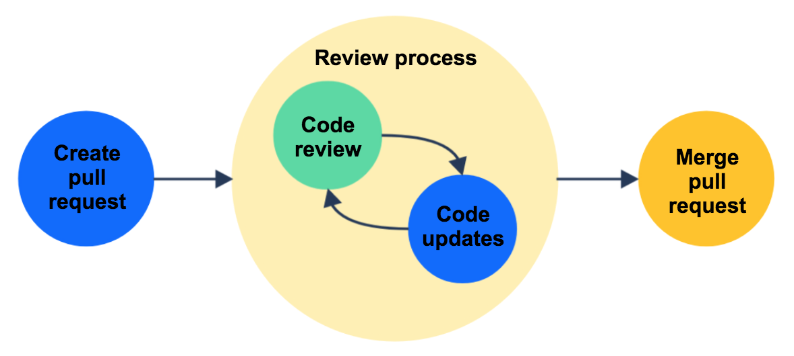
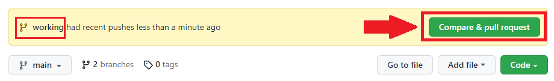
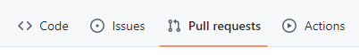
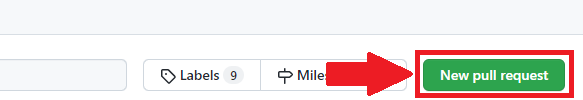
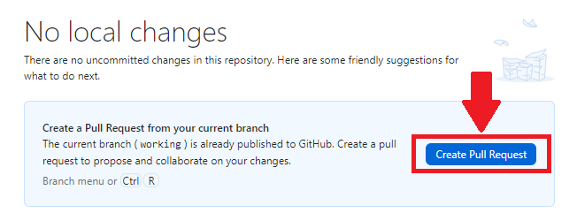
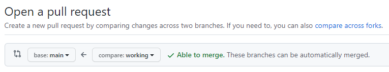
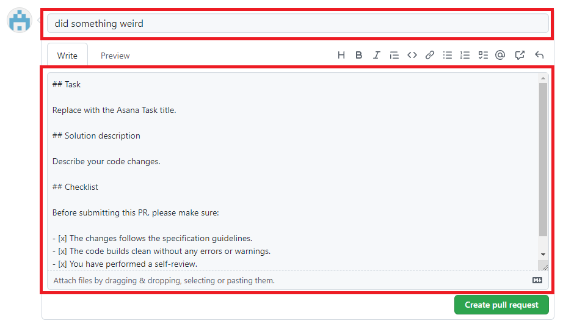
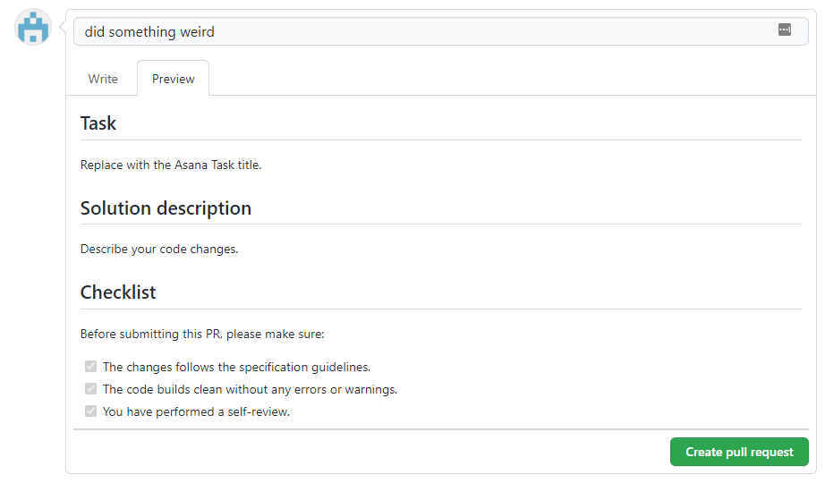
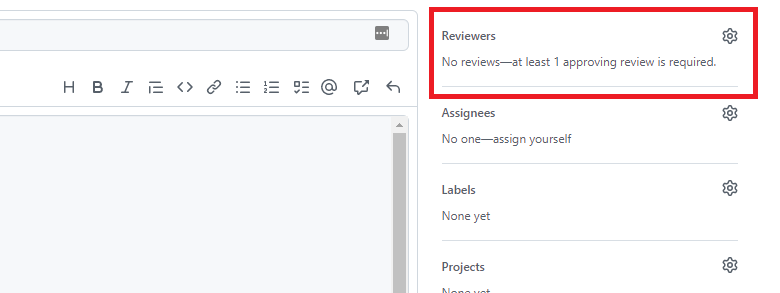

# Workflow for pull requests on Github

#### Working on a feature or issue branch

Create a separate branch for the new feature or issue. Update, add, commit, and push changes in that branch.

## Start a pull request (PR)

Once you finish the work in the dedicated branch, you are ready to make a PR to the target main branch.

### 1. Click on `Compare & pull request` or `Create pull request`

#### In your repository

The `Compare & pull request` button will appear in your repository after you push any changes. Check the branch in that message box to ensure it is the one for which you want to create a PR, and then click the button.

If you can't find the `Compare & pull request` button show up in your repository you can create PR in [pull requests section](#pull-requests-section).

#### Pull requests section

Navigate to `Pull requests` section **in your repository**.

 

Click `New pull request` button.

#### Github desktop

Click `Create pull request` button.

### 2. Select your PR base branch and compare branch

If you navigate through `Compare & pull request` button, it should automatically set the base branch to main and compare branch as the branch that has the most recent changes.

**base:** the branch where you want to merge your changes into.

**compare:** the topic branch where you made your changes.

### 3. Write your PR title and description

Description accepts [Markdown syntax](https://www.markdownguide.org/basic-syntax/).

The [PR template](./pull-request-template.md) will automatically apply to the description when the PR is created. Fill in the Task title, Solution description, and Checklist.

You can also toggle to see a preview of the description.

### 4. Request reviewers

Go to `Reviewers` and select users from the list to review your PR.

### 5. Submit PR

Before submitting this PR, ensure that you have reviewed all of your changes, then click on `Create pull request`.

### 6. Sit tide and wait for your PR review to be completed.

[Code review guide](./code-review-guide.md)

### 7. Merge PR
