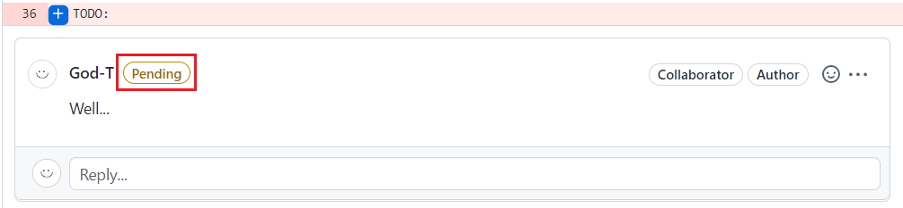
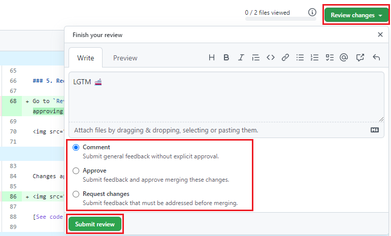

# Code Review Guide

## Why code review

It assists developers in discovering bugs earlier, learning the code base, improving coding performance, sharing new technologies and techniques with one another, and making source code readable by anyone who may be introduced to the project at any time during development.

For junior developer, the code review process allows them to learn optimisation techniques and improve the performance of their code from more experienced developers. It also gives them a chance to hone their skills and become experts in their field.

## How to review code in PR

When someone request a review form you, you will receive an e-mail and Github notification that you can start the review there.

### Start the reviewing

In PR page, click on `Add your review` button in message bo OR click on `Files changed`in tab bar.

### Add single comment or start a review

You can start the review by adding inline comments in the files changed view
of PR, you can choose to leave single comments or start a review.

When you start a review, all of the inline comments will be marked as pending.

### Share a review

When you are ready to share the review, click the `Review changes` button and leave a summary of the review, then select to `Approve`, `Request change`, or simply leave general `Comment` without explicit approval.

TODO:

[Video explains how to do code review on Github](https://www.youtube.com/watch?v=HW0RPaJqm4g)

### Review again

TODO:

## What to look for in Code Review

### In General

> **Make sure**
>
> - **Naming are clear and follow the naming convention.**
> - **The code adheres to our [style guidelines](#some-style-guides).**
> - **Comments are clear, useful and explaining why instead of what.**
> - **Code has well-designed unit tests.**
> - **The code isn’t more complex than it needs to be.**

### Code health

Refer to [Best practices in code writing](#Best-practices-in-code-writing).

### Readable?

In most circumstances, reviewers should examine each line of code that has been allocated to them. Reviewers may choose to scan over large data structures, generated code, and so on; but, do not scan over any human-written block of code and presume that what is inside is fine.

When the reviewer's reviewing pace is slowed by difficult-to-read code, the authors must provide clarification. Also, if a reviewer does not feel qualified to conduct any aspect of the review, make sure there is at least one qualified reviewer, especially for complicated topics like privacy, security, concurrency, accessibility, internationalisation.

### Tests

Check that the tests in the CL are correct, reasonable, and applicable ([See guide](#testing)).

### Compliment & Mentoring

It is sometimes more helpful to encourage and appreciate good coding practises than to point out errors. Code review gives developers the opportunity to learn new things from others; in the long run, developers sharing information with one another is part of enhancing a system's code health.

## Best practices in code writing

ESLint will check the code style of code in Visual Studio Code, fix warnings and errors that can not be automatically fixed on save.

### Clarity

Follow consistent code style and naming conventions applicable to the language.

- [How to write clean code](./Clean_Code.pdf)

#### Some style guides based on coding languages:

- [HTML/CSS Style Guide](https://google.github.io/styleguide/htmlcssguide.html)
- [TypeScript Style Guide](https://google.github.io/styleguide/tsguide.html)
- [JavaScript Style Guide](https://google.github.io/styleguide/jsguide.html)
- [C# Style Guide](https://google.github.io/styleguide/csharp-style.html)

### Complexity

Good code is simple and efficient, easy to understand by code readers, and easy to use when other developers encounter it in the future. Avoid over-engineering, which involves not making the code more generic than necessary, or adding unneeded functions.

### Comments

It is recommended to write comments for code in clear, useful and understandable English.

An useful comment explains why the code exists rather than what the code is doing (Unless it's a regular expression or a complex algorithm, in which case comments clarifying what they do are useful), such as the purpose of a piece of code, how it should be used, and how it behaves when used.

### Testing

Ensure the tests actually fail when the code is broken, and producing false positives if the code underlying them changes. Each test capable of producing straightforward and relevant assertions. Also tests should properly divided into distinct test methods.

[Angular testing guide](https://angular.io/guide/testing)

### Reusability and Scalability

Avoid developing duplicated code for similar functions, instead developers should analyze the conditions and requirements, refactor the code into reuseable functions ([Complexity](#Complexity) also needs to be considered).

Code should be easily extended and adapted as it won't be discarded when new requirements emerge.

## Reference

[Google-eng-practices](https://google.github.io/eng-practices)

[Best-practices-to-improve-code-quality](https://www.encora.com/insights/best-practices-to-improve-code-quality)
